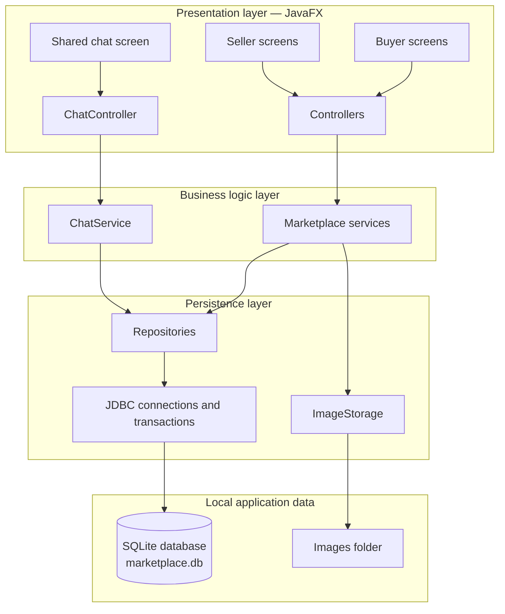
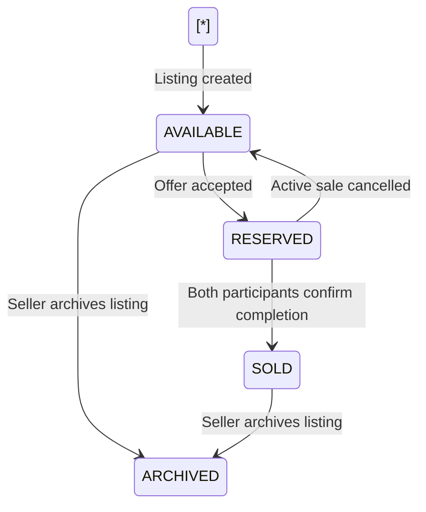
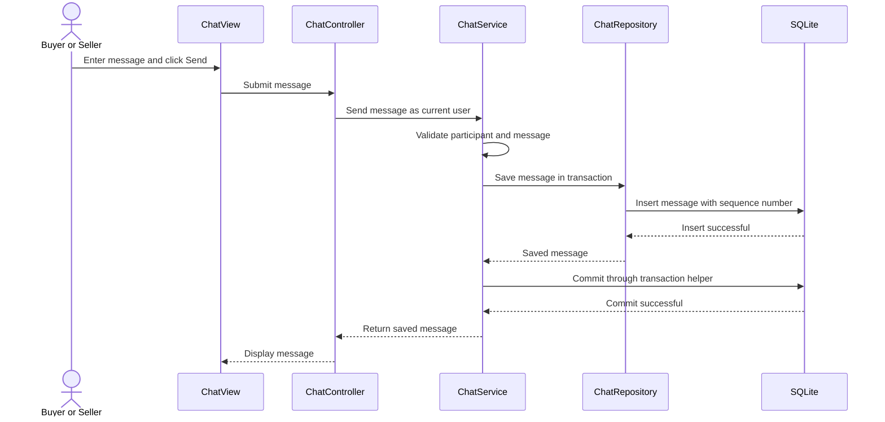

# Campus Marketplace — Application Architecture

## 1. Project overview

The project is a Java desktop marketplace where buyers and sellers can list items, exchange messages, negotiate through offers, arrange meetups, and complete transactions.

The application uses **JavaFX for the interface and SQLite for local storage**. SQLite runs within the application, so users do not need to install or configure a separate database server.

The initial version supports one running application instance using one local database. Every user can buy and sell. A user is the seller of their own listing and a potential buyer of another user's listing; these are contextual roles, not assigned account types.

The application works offline. Separate installations have separate data and do not automatically exchange listings or messages.

## 2. Technology choices

| **Component**        | **Choice**                    | **Purpose**                                |
| -------------------- | ----------------------------- | ------------------------------------------ |
| Programming language | Java SE 25                    | Application logic                          |
| Desktop interface    | JavaFX                        | Screens, forms, tables, and chat interface |
| Build tool           | Gradle                        | Dependencies, testing, and packaging       |
| Database             | SQLite                        | Persistent local SQL storage               |
| Database access      | JDBC with Xerial SQLite JDBC  | Connect Java repositories to SQLite        |
| Image storage        | Local application data folder | Listing and profile images                 |
| Schema management    | Versioned SQL migrations      | Create and update database tables          |

The SQLite library is bundled with the application. A JAR distribution still requires a suitable Java runtime; platform-specific packages can also bundle that runtime.

## 3. Overall architecture



Each component has a clear responsibility:

| **Component**           | **Responsibility**                                             |
| ----------------------- | -------------------------------------------------------------- |
| Screens                 | Display information and collect user input                     |
| Controllers             | Handle interface actions and call services                     |
| Services                | Apply validation, permissions, and marketplace rules           |
| Models                  | Represent users, listings, offers, messages, and other records |
| Repositories            | Execute SQL and map database rows to Java objects              |
| Database infrastructure | Open connections, run migrations, and coordinate transactions  |
| Image storage           | Copy, retrieve, and manage local image files                   |

Controllers do not execute SQL. Repositories do not decide whether a business action is permitted.

## 4. Screens and controllers

After login, users enter Search with no results until they submit a query. One
shared sidebar groups Buying and Selling activities; users do not switch roles.
The implemented screens and interaction decisions are recorded in
[UI Design Scope](docs/UiDesignScope.md).

| **Buyer screens**          | **Seller screens**             |
| -------------------------- | ------------------------------ |
| Browse and search listings | My listings                    |
| Listing details            | Create and edit listing        |
| Wishlist                   | Incoming offers                |
| My offers                  | Active sales and sales history |
| Purchases and meetups      | Availability and meetups       |
| Conversations and chat     | Conversations and chat         |

Shared screens include login, registration, profile management, and notifications.

Each controller reads input, calls a service, and displays success or an appropriate error.

For example:

> Buyer clicks “Make offer” → controller reads the amount → `OfferService` validates the request → repository saves the offer → controller refreshes the screen.

Database work runs on a background worker. Updates to JavaFX controls occur on the JavaFX application thread.

Buyer and seller interfaces reuse the same chat component. It contains:

- A conversation list with the listing title, other participant, latest message preview, and unread indicator.
- Message history with sender names and timestamps.
- A message input box and send button.
- A link to the associated listing.

## 5. Services and business rules

Services organise behaviour around features. Both user roles call the same service when participating in a shared workflow.

| **Service**         | **Responsibilities**                                                                         |
| ------------------- | -------------------------------------------------------------------------------------------- |
| AccountService      | Registration, login, logout, profiles, and current-user identity                             |
| ListingService      | Create, edit, search, view, and archive listings                                             |
| OfferService        | Submit, withdraw, accept, and reject offers                                                  |
| MeetupService       | Manage availability, book appointments, propose rescheduling, and cancel meetups             |
| TransactionService  | Record completion confirmations, complete or cancel sales, and retrieve history              |
| WishlistService     | Add, remove, and retrieve saved listings                                                     |
| ChatService         | Create or retrieve conversations, send messages, retrieve history, and update read positions |
| NotificationService | Retrieve notifications and mark them as read                                                 |

Permissions are checked in services, even when the interface already hides unavailable actions.

Examples:

- Only the owner can edit a listing.
- A buyer cannot make an offer on their own listing.
- Only conversation participants can access its messages.
- Only transaction participants can confirm completion.
- A reserved or sold item cannot receive new offers.

The current user comes from the authenticated application session, rather than an arbitrary user ID supplied by a screen.

## 6. Models and database tables

Java models remain independent of JavaFX and SQL. Repositories translate between models and database records.

| **Model or record** | **Table**                   | **Main information**                                                                               |
| ------------------- | --------------------------- | -------------------------------------------------------------------------------------------------- |
| User                | users                       | ID, username, display name, profile image, preferred pickup location; credentials managed separately |
| Listing             | listings                    | ID, seller ID, title, description, category, price in cents, condition, pickup location, status    |
| Listing image       | listing_images              | Listing ID, relative filename, display order                                                       |
| Offer               | offers                      | ID, listing ID, buyer ID, amount in cents, status                                                  |
| Transaction         | transactions                | ID, listing ID, accepted offer ID, buyer/seller IDs, agreed price, title/description/condition snapshots, status, confirmation timestamps |
| CancellationRequest | transaction_cancellation_requests | ID, transaction ID, requester ID, creation time, status, resolution time |
| MeetupSlot          | meetup_slots                | ID, seller ID, available start/end time, location                                                  |
| Meetup              | meetups                     | ID, transaction ID, slot ID, agreed time/location, status                                          |
| Reschedule proposal | meetup_reschedule_proposals | Meetup ID, proposer ID, proposed slot, status                                                      |
| WishlistEntry       | wishlist_entries            | Buyer ID and listing ID                                                                            |
| Conversation        | conversations               | ID, listing ID, buyer ID, seller ID, creation time, each participant’s last-read position          |
| Message             | messages                    | ID, conversation ID, sender ID, text, sequence number, sent time                                   |
| Notification        | notifications               | Recipient ID, event type, related record reference, creation time, read time                       |
| Schema migration    | schema_migrations           | Applied migration version and application time                                                     |

Models assign UUIDs at creation and use IDs for references. Store SGD prices as positive integer cents (`long` in Java); both listing prices and offers must be at least one cent, and offers may exceed asking price. Models use `Instant` for timestamps; persistence can translate them to UTC epoch values. Convert timestamps to local time for display.

The shared `User` model excludes password hashes. AccountService persists credentials in a separate `credentials` table and uses a separate representation. There is no `user_roles` table. Validated `User.restore` preserves UUID identity when loading or replacing profiles.

The implemented model milestone and validation rules are described in [Buyer Model Design](docs/BuyerModelDesign.md). AccountService, account persistence, authentication, profile-image storage, and application lifecycle initialization are now implemented as described in [AccountService Design](docs/AccountServiceDesign.md). ListingService, including seller listing management, buyer search, listing tables, and listing images, is implemented as described in [ListingService Design](docs/ListingServiceDesign.md). OfferService, including buyer offers, seller acceptance and rejection, and saving the new transaction on acceptance, is implemented as described in [OfferService Design](docs/OfferServiceDesign.md); notification creation on acceptance (step 7 in section 9) is deferred to NotificationService. TransactionService, including completion confirmations, direct and mutually agreed cancellation, sales and purchase history, and the sales dashboard summary, is implemented as described in [TransactionService Design](docs/TransactionServiceDesign.md). MeetupService, including seller-offered meetup slots, buyer booking, move proposals, cancellation, and closing a sale's meetup when the sale completes or is cancelled, is implemented as described in [MeetupService Design](docs/MeetupServiceDesign.md); slots belong to one sale rather than a seller's general availability, so the meetup tables differ from the table above. ChatService, including buyer-started conversations (by message or by offer), messages, read positions with unread counts that include offer events, and the conversation list, is implemented as described in [ChatService Design](docs/ChatServiceDesign.md). Account, profile, listing/search, offer, sale, and dashboard screens are implemented as specified in [UI Design Scope](docs/UiDesignScope.md), the conversation screens as specified in [Chat Screens Design](docs/ChatScreensDesign.md), and meetups inside the conversation as specified in [Meetup Screens Design](docs/MeetupScreensDesign.md). Other services and their tables remain planned, with disabled UI entry points labelled Coming soon.

Listings represent indivisible sales without quantity tracking. Categories are Electronics, Books, Clothing, Furniture, Sports, and Other; conditions are New, Like new, Good, Fair, and Poor. Listing images are optional, with at most ten in explicit display order.

Only available listings can be edited. Actual changes to title, description, price, category, condition, pickup location, or images reject all pending offers; unchanged saves do not. Reserved sale details are frozen. Sold and archived listings cannot be edited or reopened. Archiving an available listing rejects its pending offers and hides it from browsing while retaining history. Reserved listings require transaction cancellation before archival.

Each buyer may have at most one pending offer per listing. An amount change requires withdrawal and a new offer; closed offers remain in history. Services enforce these cross-record rules and perform related changes atomically.

Use IDs to connect records rather than copying complete objects.

Listing L101 belongs to seller U1

Offer O201 references listing L101 and buyer U2

Transaction T301 references accepted offer O201

Meetup M401 references transaction T301

Conversation C501 references listing L101, buyer U2, and seller U1

Message M601 references conversation C501 and sender U2

A transaction is created when an offer is accepted. Buyer purchase history and seller sales history query the same transaction records.

## 7. Repositories and SQLite connections

| **Repository**         | **Data handled**                                   |
| ---------------------- | -------------------------------------------------- |
| UserRepository         | Accounts and profiles; authentication reads credentials separately |
| ListingRepository      | Listings and image references                      |
| OfferRepository        | Offers                                             |
| TransactionRepository  | Sales, confirmations, cancellation requests, and transaction history |
| MeetupRepository       | Availability, bookings, and rescheduling proposals |
| WishlistRepository     | Saved listings                                     |
| ChatRepository         | Conversations, messages, and read positions        |
| NotificationRepository | Notifications and read status                      |

A shared connection provider opens the database using an absolute path:

jdbc:sqlite:/absolute/path/to/Marketplace/marketplace.db

For every connection:

- Enable foreign-key enforcement before starting transactions.
- Configure a bounded wait for database locks.
- Close connections and statements when the operation finishes.
- Use prepared statements for user-provided values.

Explicit foreign-key configuration is necessary because applications should not assume it is enabled by default.[ SQLite foreign-key documentation](https://www.sqlite.org/foreignkeys.html)

For the initial version, queue database operations through one background worker. Keep operations short and never hold a database transaction open while waiting for user input.

**All repository calls participating in one business operation use the same connection and database transaction.**

## 8. Database constraints and statuses

Use Java enums for application statuses and matching database checks.

| **Record**          | **Statuses**                                   |
| ------------------- | ---------------------------------------------- |
| Listing             | `AVAILABLE`, `RESERVED`, `SOLD`, `ARCHIVED`    |
| Offer               | `PENDING`, `ACCEPTED`, `REJECTED`, `WITHDRAWN` |
| Transaction         | `ACTIVE`, `COMPLETED`, `CANCELLED`             |
| Cancellation request | `PENDING`, `ACCEPTED`, `REJECTED`, `WITHDRAWN` |
| Meetup              | `SCHEDULED`, `COMPLETED`, `CANCELLED`          |
| Reschedule proposal | `PENDING`, `ACCEPTED`, `REJECTED`, `WITHDRAWN` |

Database constraints reinforce service rules:

| **Rule**                                          | **Database protection**                      |
| ------------------------------------------------- | -------------------------------------------- |
| Usernames cannot repeat                           | Unique constraint on the normalised username |
| Referenced records must exist                     | Foreign keys                                 |
| Wishlist entries cannot repeat                    | Unique buyer/listing pair                    |
| Conversations cannot repeat                       | Unique buyer/listing pair                    |
| Message order cannot repeat within a conversation | Unique conversation/sequence pair            |
| Prices and amounts must be valid                  | Check constraints                            |
| An item can have only one active sale             | Unique listing ID among active transactions  |
| A slot can have only one scheduled booking        | Unique slot ID among scheduled meetups       |

Services also check overlapping appointments across different slots for both participants.

Listings with transaction or conversation history are archived rather than permanently deleted.

## 9. Offer acceptance and transaction completion

A marketplace transaction represents an agreed sale. A database transaction groups changes that must succeed or fail together.

When a seller accepts an offer:

1. The controller calls `OfferService`.
2. The service begins a database transaction.
3. It verifies ownership and confirms that the offer is pending.
4. It reserves the listing only if it is still available, checking that the update succeeded.
5. It accepts the selected offer and rejects other pending offers.
6. It creates the marketplace transaction.
7. It creates relevant notifications.
8. It commits the database transaction.
9. The interface refreshes.

If a step fails before commit, roll back the operation. Do not use PostgreSQL-specific row-locking statements in SQLite.

For completion, each participant confirms separately. When both confirmations exist, the service marks the transaction completed and the listing sold in one database transaction. Completed sales are final in this milestone.

Before the first confirmation, either participant may cancel directly. After the first confirmation, cancellation requires an explicit request accepted by the other participant. There can be only one pending cancellation request per transaction. While pending, it blocks further completion confirmations and keeps the transaction active and listing reserved. The requester may withdraw it, and the other participant may reject it. Rejection or withdrawal preserves prior completion confirmations; further requests are allowed and all outcomes remain in history.

Cancelling an active sale releases the listing and cancels its upcoming meetup and pending rescheduling proposals together when those features are implemented. Prior offers remain closed. The transaction retains the agreed price and snapshots of the listing title, description, and condition, but not pickup location.



## 10. Chat architecture

Each buyer–listing pair has one conversation. A conversation can exist before an offer or transaction.

Clicking “Chat with seller” retrieves the existing conversation or creates one. Different buyers have separate conversations with the same seller.



The service:

1. Checks that the current user is a participant.
2. Rejects blank or excessively long messages.
3. Assigns the next sequence number within the conversation.
4. Saves the message in a database transaction.
5. Returns the saved message after commit.

Messages display in sequence order. Each participant has a last-read sequence number, which advances when they view messages. This supports unread indicators without depending only on timestamps.

Refresh conversations when opened and provide a manual refresh action. Periodic background refresh can be added later if multiple application instances are supported.

Chat rules:

- Buyers cannot start conversations on their own listings.
- Only the buyer and seller can access a conversation.
- Saying “I accept” in a message does not accept a formal offer.
- Conversations remain readable after an item is sold or archived.
- The initial version supports text only.
- Attachments, typing indicators, message editing, and deletion are outside the initial scope.

## 11. Local files and application startup

A proposed source layout is:

```text
src/main/java/.../
├── ui/
├── controller/
├── service/
├── model/
├── repository/
├── database/
└── storage/

src/main/resources/
├── views/
├── styles/
└── db/
    └── migration/
```

Runtime data lives in a writable user-data folder outside the JAR:

```text
Marketplace/
├── marketplace.db
└── images/
```

SQLite may create journal or companion files alongside the database. The application should not delete these manually.

On startup:

1. Determine the application data directory.
2. Create it if necessary.
3. Acquire an application lock to prevent a second instance using the same data directory.
4. Open or create the SQLite database.
5. Enable connection settings and apply outstanding migrations.
6. Display the login screen. Successful login opens the shared marketplace shell and Search.

An existing database is preserved. Startup must not recreate tables destructively or reset user data.

If setup fails, show an error rather than silently replacing the database with an empty one.

The implemented runtime defaults to `.hotshop` under the user's home directory;
`hotshop.dataDir` can override this location. Account operations and session changes
run through one shared service worker. Registration does not log in, and application
restart always begins logged out. Public-profile reads require login and omit the
owner's preferred pickup location. ListingService owns seller-listing queries and buyer search.

Profile images use a managed `images/profiles` namespace and a durable cleanup
queue. Profile JPEG/PNG imports are limited to 5 MiB and 512 pixels in each
dimension; listing photos use `images/listings`, 10 MiB, and 4096 pixels. Each
namespace has its own cleanup queue rows. Startup retries failed
cleanup and removes unreferenced generated profile-image files after checking
persisted references.

## 12. Images, backups, and packaging

Copy uploaded images into the application’s image folder and store relative filenames in SQLite.

Database transactions do not include filesystem changes. Image handling must therefore clean up newly copied files if saving their database references fails. Avoid deleting an existing image before the replacement is successfully saved.

Backups include both the database and images. Use SQLite’s backup facilities, or perform a controlled backup after database work has stopped and connections have closed. Do not copy only the main database file while it is actively changing.

Bundle the SQLite JDBC driver and dependencies with the application. Users do not need PostgreSQL, SQLite command-line tools, or a database management application.

For a runtime-bundled distribution, build and test separate packages for the supported operating systems. Retain the runnable JAR required by the project brief.

## 13. Team responsibilities and testing

One teammate owns buyer screens and buyer actions. The other owns seller screens and seller actions.

Both agree on:

- Models and database schema.
- Service interfaces.
- Status transitions and permissions.
- Migration conventions.
- Shared transaction handling.
- Chat integration.

Assign one person to implement the reusable chat component and service, with both testing their role’s interaction.

Share source code, migrations, and sample-data scripts through Git. Exclude runtime databases, journal files, personal images, and backups.

Build this complete workflow first:

**Create listing → browse → exchange messages → submit offer → accept offer → restart app → verify persistence.**

Then add meetups, completion confirmations, wishlists, and dashboards.

Verification should include:

- Service tests for permissions and business rules.
- Repository tests using temporary SQLite databases.
- Migration tests for fresh databases and upgrades.
- Rollback tests for partially failed operations.
- Chat access, ordering, and unread-state tests.
- Persistence and backup/restore checks.
- Complete buyer and seller journeys.

## 14. Scope and limitations

SQLite supports the planned local marketplace without a separate database server. Its embedded design is suitable for application-local storage.[ SQLite overview](https://www.sqlite.org/serverless.html)

The first release assumes one running application instance per data directory. Accounts on that installation share listings and chat history.

Separate computers have separate databases. Supporting an online marketplace would require a shared backend and changes to authentication, storage, and message delivery. A live SQLite file should not be placed in a shared or synchronised folder as a substitute for that backend.
